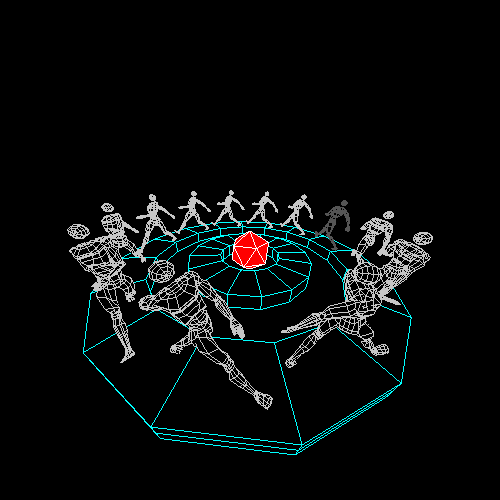

<h1 align="center">Hi 👋, I'm Fernando Vázquez</h1>
<h3 align="center">Mechanical Engineering Specialist & Self-Taught Software Developer</h3>

<p align="center">
  
</p>

<p align="center">
  <i>Bridging Mechanical Engineering and Software Development through Automation, Web Technologies, and CAD Modeling.</i>
</p>

---

### 👨‍💻 About Me

```yaml
name: Fernando Vázquez
location: Estado de Mexico, Mexico
current_role: Static Equipment Specialist at Sener (Senermex Energy)
education:
  - Bachelor's Degree in Mechanical Engineering
  - Self-Taught Software Developer

fields_of_interest:
  - Engineering Automation & CAD Integration
  - Full-Stack Web Development
  - UI/UX & DevOps

currently_learning:
  - Next.js & React Ecosystem
  - KeystoneJS
  - CAD Scripting & Python Automation

currently_working_on: pybricscad # Python library for 2D/3D pressure vessel modeling in BricsCAD
hobbies:
  - 🎬 Cinema
  - 🏃 Running
  - 📚 Reading
```

---

### 🛠️ Languages & Tools

#### **Programming & Web Development**
<p align="left">
  <a href="https://www.python.org" target="_blank" rel="noreferrer">
    
  </a>
  <a href="https://developer.mozilla.org/en-US/docs/Web/JavaScript" target="_blank" rel="noreferrer">
    
  </a>
  <a href="https://www.typescriptlang.org/" target="_blank" rel="noreferrer">
    
  </a>
  <a href="https://reactjs.org/" target="_blank" rel="noreferrer">
    
  </a>
  <a href="https://nextjs.org/" target="_blank" rel="noreferrer">
    
  </a>
  <a href="https://www.w3.org/html/" target="_blank" rel="noreferrer">
    
  </a>
  <a href="https://www.w3schools.com/css/" target="_blank" rel="noreferrer">
    
  </a>
</p>

#### **DevOps, Cloud & Databases**
<p align="left">
  <a href="https://www.docker.com/" target="_blank" rel="noreferrer">
    
  </a>
  <a href="https://cloud.google.com" target="_blank" rel="noreferrer">
    
  </a>
  <a href="https://firebase.google.com/" target="_blank" rel="noreferrer">
    
  </a>
  <a href="https://www.postgresql.org" target="_blank" rel="noreferrer">
    
  </a>
  <a href="https://git-scm.com/" target="_blank" rel="noreferrer">
    
  </a>
  <a href="https://www.linux.org/" target="_blank" rel="noreferrer">
    
  </a>
</p>

---

### 📫 Connect with Me

<p align="left">
  <a href="https://linkedin.com/in/fernandovzfv" target="_blank">
    
  </a>
  <a href="mailto:fernando.vazquez@telmexmail.com" target="_blank">
    
  </a>
</p>
